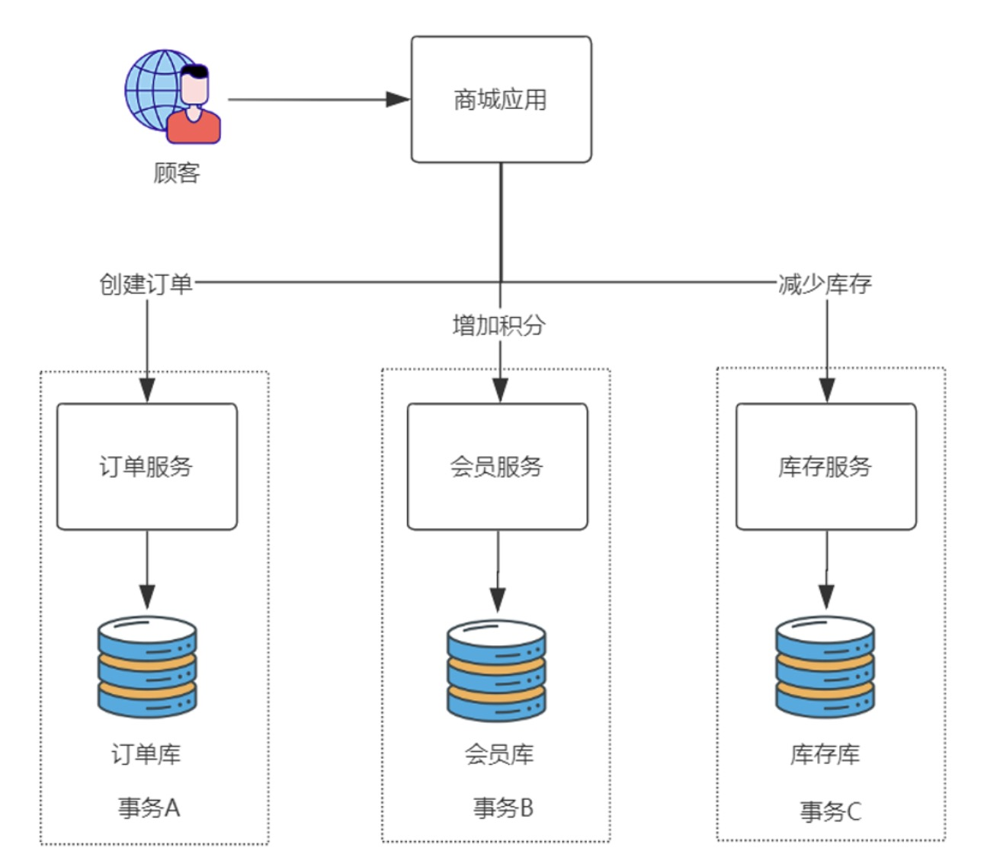
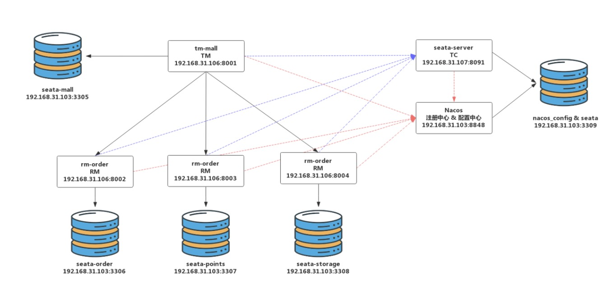
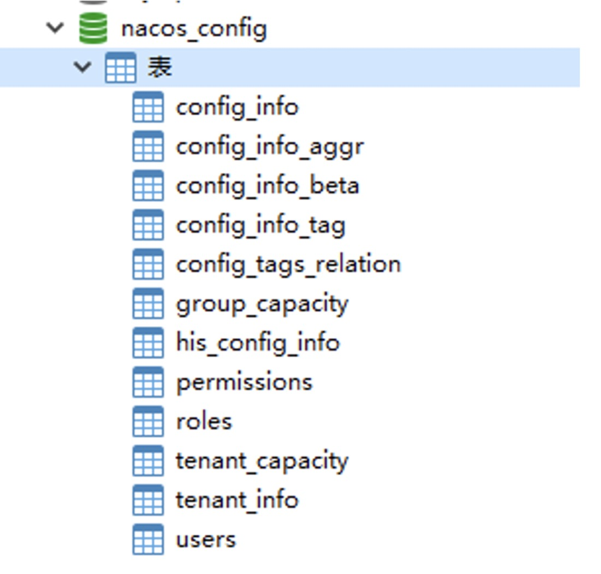

### 利用 Seata 与 Nacos 构建分布式事务架构
- 部署 Nacos 注册中心与配置中心；

- 部署 TC 组件 Seata-Server；

- 开发 RM 资源管理器；

- 开发 TM 事务管理器；

- 验证分布式事务。

#### 案例-商城销售积分


#### 整体架构图


在 192.168.31.103 虚拟机构建了 5 个 MySQL 5.7 数据库实例，通过设置不同端口来模拟 5 台数据库服务器，它们的用途是：

- 3309 端口数据库存储 Nacos 配置信息以及 Seata-Server 的分布式事务数据；

- 3305 端口数据库存储 TM 端商城数据；

- 3306 端口数据库存储 RM 端订单服务数据；

- 3307 端口数据库存储 RM 端会员积分数据；

- 3308 端口数据库存储 RM 端库存数据。

应用方面包含 6 个节点：

- 192.168.31.103:8848 节点是 Nacos 注册中心与配置中心服务器，提供微服务架构核心支撑；

- 192.168.31.107:8091 节点是 Seata-Server，也就是 TC 组件，用于协调全局事务的开启、提交与回滚；

- 192.168.31.106:8001 节点是 TM，也就是商城应用，TM用于定义事务边界与事务的范围；

- 192.168.31.106:8002/8003/8004 则是具体的 RM 实例，分别对应订单、积分与库存服务。

其中所有 TM、RM、TC 实例在启动时都要向 Nacos 进行注册登记，以保证服务可以被发现。同时 TC(Seata-Server) 自身的配置信息也要托管在 Nacos 配置中心中，不再单独存储。所有 TM、RM 在启动时也要额外在 TC 中进行注册，以保证全局事务的完整性。

#### 部署 Nacos 注册中心与配置中心
第一步，下载 Nacos，上传到 192.168.31.103 节点解压缩。
```text
tar -xvf nacos-server-1.4.0.tar.gz
```

第二步，配置 conf/application.properties，增加数据库配置。
```text
### Count of DB:
db.num=1
### Connect URL of DB:
db.url.0=jdbc:mysql://192.168.31.103:3309/nacos_config?characterEncoding=utf8&connectTimeout=1000&socketTimeout=3000&autoReconnect=true&useUnicode=true&useSSL=false&serverTimezone=UTC
db.user=root
db.password=root
```

第三步，创建 3309 端口的 nacos_config 数据库，执行 conf/nacos-mysql.sql，完成 Nacos 注册中心表创建。


第四步，创建 conf/cluster.conf 集群配置文件，配置一个单节点集群。
```text
#it is ip
#example
192.168.31.10:8848
```

第五步，运行 startup 脚本，启动 Nacos。
```text
sh /usr/local/nacos/bin/startup.sh
```

#### 部署 TC 组件 Seata-Server
第一步，下载 Seata-Server。

在 192.168.31.107 设备上安装好 JDK 1.8，之后访问 Seata 的 GitHub，下载最新的 1.4.0 压缩包。

https://github.com/seata/seata/releases/download/v1.4.0/seata-server-1.4.0.tar.gz

解压后将 seata-server-1.4 上传到 192.168.31.107 节点的 /usr/local 目录下。

第二步，编辑 conf/registry.conf 文件，这个配置文件说明 Seata-Server 接入哪种注册中心与配置中心，官方提供的默认模板存在大量冗余配置，这里提供接入 Nacos 最精简的配置内容以方便学习。下面是 Seata-Server 接入注册中心的配置信息。
```text
registry {
  # Seata-Server支持以下几种注册中心，这里改为nacos，默认是file文件形式不介入任何注册中心。
  # file 、nacos 、eureka、redis、zk、consul、etcd3、sofa
  type = "nacos"
  # 负载均衡采用随机策略
  loadBalance = "RandomLoadBalance"
  loadBalanceVirtualNodes = 10
  # nacos注册中心接入配置
  nacos {
    # 应用名称
    application = "seata-server"
    #IP地址与端口
    serverAddr = "192.168.31.10:8848"
    # 分配应用组，采用默认值SEATA_GROUP即可
    group = "SEATA_GROUP"
    namespace = ""
    # 集群名称，采用默认值default即可
    cluster = "default"
    # Nacos接入用户名密码
    username = "nacos"
    password = "nacos"
  }
}
#Seata-Server接入配置中心
config {
  # Seata-Server支持以下配置中心产品，这里设置为nacos，默认是file即文件形式保存配置内容。
  # file、nacos 、apollo、zk、consul、etcd3
  type = "nacos"
  # 设置Nacos的通信地址
  nacos {
    serverAddr = "192.168.31.10:8848"
    namespace = ""
    group = "SEATA_GROUP"
    username = "nacos"
    password = "nacos"
  }
}
```

第三步，在 Nacos 配置中心中初始化 Seata 配置。

首先访问下面的地址查看 Seata 在 Nacos 中需要的设置项。

https://github.com/seata/seata/blob/1.4.0/script/config-center/config.txt

将 GitHub 页面中 80 行全部文本内容复制后，在 /usr/local/seata-server-1.4.0 目录下创建 config.txt 文件，将 80 行文本粘贴其中。
````properties
transport.type=TCP
transport.server=NIO
transport.heartbeat=true
transport.enableClientBatchSendRequest=false
transport.threadFactory.bossThreadPrefix=NettyBoss
transport.threadFactory.workerThreadPrefix=NettyServerNIOWorker
transport.threadFactory.serverExecutorThreadPrefix=NettyServerBizHandler
transport.threadFactory.shareBossWorker=false
transport.threadFactory.clientSelectorThreadPrefix=NettyClientSelector
transport.threadFactory.clientSelectorThreadSize=1
transport.threadFactory.clientWorkerThreadPrefix=NettyClientWorkerThread
transport.threadFactory.bossThreadSize=1
transport.threadFactory.workerThreadSize=default
transport.shutdown.wait=3
service.vgroupMapping.my_test_tx_group=default
service.default.grouplist=127.0.0.1:8091
service.enableDegrade=false
service.disableGlobalTransaction=false
client.rm.asyncCommitBufferLimit=10000
client.rm.lock.retryInterval=10
client.rm.lock.retryTimes=30
client.rm.lock.retryPolicyBranchRollbackOnConflict=true
client.rm.reportRetryCount=5
client.rm.tableMetaCheckEnable=false
client.rm.sqlParserType=druid
client.rm.reportSuccessEnable=false
client.rm.sagaBranchRegisterEnable=false
client.tm.commitRetryCount=5
client.tm.rollbackRetryCount=5
client.tm.defaultGlobalTransactionTimeout=60000
client.tm.degradeCheck=false
client.tm.degradeCheckAllowTimes=10
client.tm.degradeCheckPeriod=2000
store.mode=file
store.file.dir=file_store/data
store.file.maxBranchSessionSize=16384
store.file.maxGlobalSessionSize=512
store.file.fileWriteBufferCacheSize=16384
store.file.flushDiskMode=async
store.file.sessionReloadReadSize=100
store.db.datasource=druid
store.db.dbType=mysql
store.db.driverClassName=com.mysql.jdbc.Driver
store.db.url=jdbc:mysql://127.0.0.1:3306/seata?useUnicode=true
store.db.user=username
store.db.password=password
store.db.minConn=5
store.db.maxConn=30
store.db.globalTable=global_table
store.db.branchTable=branch_table
store.db.queryLimit=100
store.db.lockTable=lock_table
store.db.maxWait=5000
store.redis.host=127.0.0.1
store.redis.port=6379
store.redis.maxConn=10
store.redis.minConn=1
store.redis.database=0
store.redis.password=null
store.redis.queryLimit=100
server.recovery.committingRetryPeriod=1000
server.recovery.asynCommittingRetryPeriod=1000
server.recovery.rollbackingRetryPeriod=1000
server.recovery.timeoutRetryPeriod=1000
server.maxCommitRetryTimeout=-1
server.maxRollbackRetryTimeout=-1
server.rollbackRetryTimeoutUnlockEnable=false
client.undo.dataValidation=true
client.undo.logSerialization=jackson
client.undo.onlyCareUpdateColumns=true
server.undo.logSaveDays=7
server.undo.logDeletePeriod=86400000
client.undo.logTable=undo_log
client.log.exceptionRate=100
transport.serialization=seata
transport.compressor=none
metrics.enabled=false
metrics.registryType=compact
metrics.exporterList=prometheus
metrics.exporterPrometheusPort=9898
````

在内容粘贴到 config.txt 后，有两个地方需要修改：

- 34 行 store.mode=file 改为 store.mode=db 代表采用数据库存储 Seata-Server 的全局事务数据

- 44~46 行配置 Seata-Server 的全局事务数据库，数据库 URL 指向 107 节点 3309 端口。这个全局事务数据库是 Seata 维护分布式事务的关键所在。
```text
store.db.url=jdbc:mysql://192.168.31.103:3309/seata?useUnicode=true&rewriteBatchedStatements=true
store.db.user=root
store.db.password=root
```

config.txt 保存后，还需要访问下面地址下载 nacos-config.sh 运行脚本。

https://github.com/seata/seata/blob/1.4.0/script/config-center/nacos/nacos-config.sh
```shell
#!/usr/bin/env bash
# Copyright 1999-2019 Seata.io Group.
#
# Licensed under the Apache License, Version 2.0 (the "License");
# you may not use this file except in compliance with the License.
# You may obtain a copy of the License at、
#
#      http://www.apache.org/licenses/LICENSE-2.0
#
# Unless required by applicable law or agreed to in writing, software
# distributed under the License is distributed on an "AS IS" BASIS,
# WITHOUT WARRANTIES OR CONDITIONS OF ANY KIND, either express or implied.
# See the License for the specific language governing permissions and
# limitations under the License.

while getopts ":h:p:g:t:u:w:" opt
do
  case $opt in
  h)
    host=$OPTARG
    ;;
  p)
    port=$OPTARG
    ;;
  g)
    group=$OPTARG
    ;;
  t)
    tenant=$OPTARG
    ;;
  u)
    username=$OPTARG
    ;;
  w)
    password=$OPTARG
    ;;
  ?)
    echo " USAGE OPTION: $0 [-h host] [-p port] [-g group] [-t tenant] [-u username] [-w password] "
    exit 1
    ;;
  esac
done

if [[ -z ${host} ]]; then
    host=localhost
fi
if [[ -z ${port} ]]; then
    port=8848
fi
if [[ -z ${group} ]]; then
    group="SEATA_GROUP"
fi
if [[ -z ${tenant} ]]; then
    tenant=""
fi
if [[ -z ${username} ]]; then
    username=""
fi
if [[ -z ${password} ]]; then
    password=""
fi

nacosAddr=$host:$port
contentType="content-type:application/json;charset=UTF-8"

echo "set nacosAddr=$nacosAddr"
echo "set group=$group"

failCount=0
tempLog=$(mktemp -u)
function addConfig() {
  curl -X POST -H "${contentType}" "http://$nacosAddr/nacos/v1/cs/configs?dataId=$1&group=$group&content=$2&tenant=$tenant&username=$username&password=$password" >"${tempLog}" 2>/dev/null
  if [[ -z $(cat "${tempLog}") ]]; then
    echo " Please check the cluster status. "
    exit 1
  fi
  if [[ $(cat "${tempLog}") =~ "true" ]]; then
    echo "Set $1=$2 successfully "
  else
    echo "Set $1=$2 failure "
    (( failCount++ ))
  fi
}

count=0
for line in $(cat $(dirname "$PWD")/config.txt | sed s/[[:space:]]//g); do
  (( count++ ))
	key=${line%%=*}
    value=${line#*=}
	addConfig "${key}" "${value}"
done

echo "========================================================================="
echo " Complete initialization parameters,  total-count:$count ,  failure-count:$failCount "
echo "========================================================================="

if [[ ${failCount} -eq 0 ]]; then
	echo " Init nacos config finished, please start seata-server. "
else
	echo " init nacos config fail. "
fi
```

这个脚本用来读取前面的 config.txt 并将配置项载入 Nacos 配置中心。将页面中 101 行全部文本复制，然后在 /usr/local/seata-server-1.4.0 目录下创建 script 子目录，在 scirpt 子目录下创建 nacos-config.sh 文件，并将 101 行文本保存其中。

保存后执行下面命令运行导入脚本。

> sh nacos-config.sh -h 192.168.31.10

这条命令有两个参数，h 选项指向 Nacos 的 IP，执行后你会看到如下日志。
```text
...
Set metrics.registryType=compact successfully 
Set metrics.exporterList=prometheus successfully 
Set metrics.exporterPrometheusPort=9898 successfully 
=========================================================================
 Complete initialization parameters,  total-count:80 ,  failure-count:0 
=========================================================================
 Init nacos config finished, please start seata-server.
```

80 个配置选项导入成功后，便可在 Nacos 的配置中心页面看到它们，访问 Nacos 后台http://192.168.31.10:8848/nacos

会看到大量 SEATA_GROUP 分组的配置，这些配置信息在 Seata-Server 启动时都会自动读取。

第四步，创建并初始化 Seata-Server 全局事务数据库。

访问下面网址

https://github.com/seata/seata/blob/1.4.0/script/server/db/mysql.sql，下载 SQL 脚本。在 3309 端口 MySQL 创建新的数据库 seata，执行 SQL 脚本创建全局事务表。

脚本执行后会创建 3 张表，了解下即可。

- global_table 保存全局事务数据；

- branch_table 保存分支事务数据；

- lock_table 保存锁定资源数据。

第五步，启动 seata-server。

seata-server 启动只需要执行 bin/seata-server.sh。
> sh bin/seata-server.sh

启动后，看到下面 Server started 代表启动成功。
```text
10:52:38.254  INFO --- [                     main] com.alibaba.druid.pool.DruidDataSource   : {dataSource-1} inited
10:52:38.501  INFO --- [                     main] i.s.core.rpc.netty.NettyServerBootstrap  : Server started, listen port: 8091
```

这里有个细节，如果启动过程中提示数据库无法访问，说明 IP、端口配置有问题，可以通过 Nacos 配置中心设置 store.db.url 选项，而不是重新导入 config.txt。

到这里，阶段二：部署 TC 组件 Seata-Server 已经完成。后面的事情就是基于 TC 组件 Seata-Server 实现分布式事务。

#### 开发 RM 资源管理器
在 Seata 中 RM 资源管理器代表处理具体业务的模块，例如：订单服务创建订单、会员服务增加积分、库存服务减少库存都是 RM 资源管理器，下面我们来开发订单服务、会员服务与库存服务。

##### 订单服务 rm-order
里开发框架采用 Spring Boot + JPA（Hibernate）+ Druid 实现。

第一步，创建 seata-order 数据库与 undo_log 表。

在 103 节点的 3306 数据库上，创建 seata-order 数据库，执行下面的 SQL 初始化数据库。

```text
SET NAMES utf8mb4;
SET FOREIGN_KEY_CHECKS = 0;
-- ----------------------------
-- Table structure for order
-- ----------------------------
DROP TABLE IF EXISTS `order`;
CREATE TABLE `order`  (
  `order_id` int(255) NOT NULL AUTO_INCREMENT COMMENT '订单编号',
  `goods_id` int(32) NOT NULL COMMENT '商品编号',
  `member_id` int(32) NOT NULL COMMENT '会员编号',
  `quantity` int(255) NOT NULL COMMENT '购买数量',
  `points` int(255) NOT NULL COMMENT '增加会员积分',
  PRIMARY KEY (`order_id`) USING BTREE
) ENGINE = InnoDB AUTO_INCREMENT = 51 CHARACTER SET = utf8 COLLATE = utf8_general_ci ROW_FORMAT = Dynamic;
-- ----------------------------
-- Table structure for undo_log
-- ----------------------------
DROP TABLE IF EXISTS `undo_log`;
CREATE TABLE `undo_log`  (
  `id` bigint(20) NOT NULL AUTO_INCREMENT,
  `branch_id` bigint(20) NOT NULL,
  `xid` varchar(100) CHARACTER SET utf8 COLLATE utf8_general_ci NOT NULL,
  `context` varchar(128) CHARACTER SET utf8 COLLATE utf8_general_ci NOT NULL,
  `rollback_info` longblob NOT NULL,
  `log_status` int(11) NOT NULL,
  `log_created` datetime(0) NOT NULL,
  `log_modified` datetime(0) NOT NULL,
  `ext` varchar(100) CHARACTER SET utf8 COLLATE utf8_general_ci NULL DEFAULT NULL,
  PRIMARY KEY (`id`) USING BTREE,
  UNIQUE INDEX `ux_undo_log`(`xid`, `branch_id`) USING BTREE
) ENGINE = InnoDB AUTO_INCREMENT = 5 CHARACTER SET = utf8 COLLATE = utf8_general_ci ROW_FORMAT = Dynamic;
SET FOREIGN_KEY_CHECKS = 1;
```

数据库包含两张表，一张是订单业务表 order，字段含义已在脚本中注释。而另一张 undo_log 回滚日志表。undo_log 是 Seata 强制要求在每个 RM 端数据库创建的表，用于存储反向 SQL 的元数据。undo_log 表的脚本可以从 Seata GitHub 官方获取，然后在自己的业务库中执行。

https://github.com/seata/seata/blob/1.4.0/script/client/at/db/mysql.sql

到这里 RM 数据库创建完毕。

第二步，利用 Spring Initializr 向导创建 rm-order 工程，确保 pom.xml 引入以下依赖。
```text
<!--Spring Boot JPA-->
<dependency>
    <groupId>org.springframework.boot</groupId>
    <artifactId>spring-boot-starter-data-jpa</artifactId>
</dependency>
<!--Web MVC-->
<dependency>
    <groupId>org.springframework.boot</groupId>
    <artifactId>spring-boot-starter-web</artifactId>
</dependency>
<!--Nacos客户端-->
<dependency>
    <groupId>com.alibaba.cloud</groupId>
    <artifactId>spring-cloud-starter-alibaba-nacos-discovery</artifactId>
</dependency>
<!--seata-->
<dependency>
    <groupId>com.alibaba.cloud</groupId>
    <artifactId>spring-cloud-starter-alibaba-seata</artifactId>
    <exclusions>
        <exclusion>
            <groupId>io.seata</groupId>
            <artifactId>seata-all</artifactId>
        </exclusion>
        <exclusion>
            <groupId>io.seata</groupId>
            <artifactId>seata-spring-boot-starter</artifactId>
        </exclusion>
    </exclusions>
</dependency>
<!--seata 客户端最新版-->
<dependency>
    <groupId>io.seata</groupId>
    <artifactId>seata-all</artifactId>
    <version>1.4.0</version>
</dependency>
<!--seata与spring boot starter-->
<dependency>
    <groupId>io.seata</groupId>
    <artifactId>seata-spring-boot-starter</artifactId>
    <version>1.4.0</version>
</dependency>
<!--JDBC驱动-->
<dependency>
    <groupId>mysql</groupId>
    <artifactId>mysql-connector-java</artifactId>
    <scope>runtime</scope>
</dependency>
```

这份依赖有个注意事项，默认 starter-alibaba-seata 依赖内置的是旧版 1.3.0 的 Seata 客户端，因此要排除，在后面引入最新的 1.4.0，保证客户端与 Seate-Server 版本一致。

第三步，配置 application.yml。

application.yml 额外配置了事务分组与 Nacos 的信息，已在配置文件中进行了注释说明。
```yaml
#seata配置
seata:
#  开启seata分布式事务
  enabled: true
#  事务服务分组名,与naocs一致
  tx-service-group: my_test_tx_group
#  是否启用数据源代理
  enable-auto-data-source-proxy: true
#  事务服务配置
  service:
    vgroup-mapping:
#      事务分组对应集群名称
      my_test_tx_group: default
    grouplist:
#      Seata-Server服务的IP地址与端口
      default: 192.168.31.107:8091
    enable-degrade: false
    disable-global-transaction: false
#    Nacos配置中心信息
  config:
    type: nacos
    nacos:
      namespace:
      serverAddr: 192.168.31.10:8848
      group: SEATA_GROUP
      username: nacos
      password: nacos
      cluster: default
#      Nacos注册中心信息
  registry:
    type: nacos
    nacos:
      application: seata-server
      server-addr: 192.168.31.10:8848
      group : SEATA_GROUP
      namespace:
      username: nacos
      password: nacos
      cluster: default
# 应用配置
spring:
  application:
    name: rm-order
  datasource:
    driver-class-name: com.mysql.cj.jdbc.Driver
    url: jdbc:mysql://192.168.31.103:3306/seata-order
    username: root
    password: root
  cloud:
    nacos:
      discovery:
        username: nacos
        password: nacos
        server-addr: 192.168.31.10:8848
  jpa:
    show-sql: true
server:
  port: 8002
logging:
  level:
    io:
      seata: debug
```

第四步，像单机应用一样开发数据库 CRUD，代码很简单，已给出注释。

Order 实体类，让属性与字段进行映射。

```java
//JPA实体类
@Entity
@Table(name = "`order`") //对应order表
public class Order {
    @Id
    @Column(name = "order_id")
    private Integer id; //订单编号
    private Integer memberId; //会员编号
    @Column(name = "goods_id")
    private Integer goodsId; //商品编号
    private Integer points; //新增积分
    private Integer quantity; //销售数量
    public Order() {
    }
    public Order(Integer id, Integer memberId, Integer goodsId, Integer points, Integer quantity) {
        this.id = id;
        this.memberId = memberId;
        this.points = points;
        this.goodsId = goodsId;
        this.quantity = quantity;
    }
    //...getter & setter
}
```

OrderRepository 接口用于声明 CRUD 操作。

```java
public interface OrderRepository extends JpaRepository<Order,Integer> {
}
```

OrderService 的 createOrder 方法实现创建订单的业务逻辑，注意在 createOrder 方法上必须增加 @Transactional 注解，Seata 客户端对这个注解进行扩展支持了分布式事务。

```java
@Service
public class OrderService {
    @Resource
    private OrderRepository orderRepository;
    @Transactional
    public Order createOrder(Integer orderId,Integer memberId,Integer goodsId,Integer points,Integer quantity){
        return orderRepository.save(new Order(orderId, memberId,goodsId,points,quantity));
    }
}
```

OrderController 的 createOrder 方法用于对外暴露 RESTful API，等待被 TM 调用。

```java
@RestController
public class OrderController {
    @Resource
    private OrderService orderService;
    @GetMapping("/create_order")
    public String createOrder(Integer orderId,Integer memberId,Integer goodsId,Integer points,Integer quantity) throws JsonProcessingException {
        Map result = new HashMap<>();
        Order order = orderService.createOrder(orderId,memberId,goodsId,points,quantity);
        result.put("code", "0");
        result.put("message", "create order success");
        return new ObjectMapper().writeValueAsString(result);
    }
}
```

第五步，最重要的一步，要让 Seata 客户端在处理事务时自动生成反向 SQL，必须额外配置 DataSourceProxy 数据源代理类，DataSourceProxy 是 Seata 提供的 DataSource 代理类，在分布式事务执行过程中，用于自动生成 undo_log 回滚数据，以及自动完成 RM 端分布式事务的提交或回滚操作。

在 Spring Boot 中利用 Java Config 方式对 DataSourceProxy 进行配置。

```java
@Configuration
public class DataSourceProxyConfig {
    //创建Druid数据源
    @Bean
    @ConfigurationProperties(prefix = "spring.datasource")
    public DruidDataSource druidDataSource() {
        return new DruidDataSource();
    }
    //建立DataSource数据源代理
    @Primary
    @Bean
    public DataSourceProxy dataSource(DruidDataSource druidDataSource) {
        return new DataSourceProxy(druidDataSource);
    }
}
```

最后，启动 rm-order，在浏览器地址栏访问 create_order 接口，看到 create order success，在数据库中也出现对应记录。

http://192.168.31.106:8002/create_order?orderId=6&memberId=1&goodsId=2&points=20&quantity=200

```json
{
    code:"0",
    message:"create order success"
}
```

以上是 rm-order 订单服务的开发过程，除了配置 Seata 选项与创建 DataSourceProxy 外，其他的开发要素与单机应用几乎是一样的，这使得新人也可以很快上手。

##### 积分服务 rm-points
因为积分服务的开发过程与订单服务几乎是一致的，只需给出关键代码。

第一步，在 3307 端口数据库创建 seata-points 数据库，包含 points 会员积分表与 undo_log 表。
```text
DROP TABLE IF EXISTS `points`;
CREATE TABLE `points`  (
  `member_id` int(255) NOT NULL COMMENT '会员编号',
  `points` int(255) NOT NULL COMMENT '积分数量',
  PRIMARY KEY (`member_id`) USING BTREE
) ENGINE = InnoDB CHARACTER SET = utf8 COLLATE = utf8_general_ci ROW_FORMAT = Dynamic;
-- ----------------------------
-- Records of points
-- ----------------------------
INSERT INTO `points` VALUES (1, 100);
INSERT INTO `points` VALUES (2, 100);
INSERT INTO `points` VALUES (3, 100);
INSERT INTO `points` VALUES (4, 100);
-- ----------------------------
-- Table structure for undo_log
-- ----------------------------
DROP TABLE IF EXISTS `undo_log`;
CREATE TABLE `undo_log`  (
  `id` bigint(20) NOT NULL AUTO_INCREMENT,
  `branch_id` bigint(20) NOT NULL,
  `xid` varchar(100) CHARACTER SET utf8 COLLATE utf8_general_ci NOT NULL,
  `context` varchar(128) CHARACTER SET utf8 COLLATE utf8_general_ci NOT NULL,
  `rollback_info` longblob NOT NULL,
  `log_status` int(11) NOT NULL,
  `log_created` datetime(0) NOT NULL,
  `log_modified` datetime(0) NOT NULL,
  `ext` varchar(100) CHARACTER SET utf8 COLLATE utf8_general_ci NULL DEFAULT NULL,
  PRIMARY KEY (`id`) USING BTREE,
  UNIQUE INDEX `ux_undo_log`(`xid`, `branch_id`) USING BTREE
) ENGINE = InnoDB AUTO_INCREMENT = 5 CHARACTER SET = utf8 COLLATE = utf8_general_ci ROW_FORMAT = Dynamic;
SET FOREIGN_KEY_CHECKS = 1;
```

第二步，创建 rm-points 积分服务，pom.xml 与 rm-order 依赖完全相同。

第三步，配置 application.yml，只有应用名、端口与数据库 URL 不同，其他与 rm-order 完全相同。

```yaml
seata:
...
spring:
  application:
    name: rm-points
  datasource:
    driver-class-name: com.mysql.cj.jdbc.Driver
    url: jdbc:mysql://192.168.31.103:3307/seata-points
    username: root
    password: root
...
server:
  port: 8003
...
```

第四步：实现新增积分代码，基础的实体类与 Repository 不做赘述，我们关注 PointsService 与 PointsController。

PointsService.addPoints 方法实现会员积分增加业务，同样需要 @Transactional 注解。

```java
@Service
public class PointsService {
    @Resource
    private PointsRepository orderRepository;
    @Transactional
    public Points addPoints(Integer memberId,Integer points){
        Points entity = orderRepository.findById(memberId).get();
        entity.setPoints( entity.getPoints() + points);
        return orderRepository.save(new Points(memberId,entity.getPoints()));
    }
}
```

PointsController 对外暴露 add_points 接口调用 service 类实现业务。

```java
@RestController
public class PointsController {
    @Resource
    private PointsService pointsService;
    @GetMapping("/add_points")
    public String addPoints(Integer memberId,Integer points) throws JsonProcessingException {
        Map result = new HashMap<>();
        Points entity = pointsService.addPoints(memberId, points);
        result.put("code", "0");
        result.put("message", "add points success");
        return new ObjectMapper().writeValueAsString(result);
    }
}
```

第五步，最后不要忘记设置 DataSourceProxyConfig，代码与 rm-order 完全相同。

代码书写完毕，启动应用访问地址http://192.168.31.106:8003/add_points?memberId=1&points=20

可以得到“add points success ”结果。

```json5
{
    code:"0",
    message:"add points success"
}
```

##### 库存服务 rm-storage
RM 库存服务也是遵循相同套路开发。

第一步，创建数据库 seata-storage，执行建表脚本，包含库存表 storage 与回滚表 undo_log。

```text
SET NAMES utf8mb4;
SET FOREIGN_KEY_CHECKS = 0;
-- ----------------------------
-- Table structure for storage
-- ----------------------------
DROP TABLE IF EXISTS `storage`;
CREATE TABLE `storage`  (
  `goods_id` int(255) NOT NULL,
  `quantity` int(255) NOT NULL,
  PRIMARY KEY (`goods_id`) USING BTREE
) ENGINE = InnoDB CHARACTER SET = utf8 COLLATE = utf8_general_ci ROW_FORMAT = Dynamic;
-- ----------------------------
-- Records of storage
-- ----------------------------
INSERT INTO `storage` VALUES (1, 100);
INSERT INTO `storage` VALUES (2, 98);
INSERT INTO `storage` VALUES (3, 100);
INSERT INTO `storage` VALUES (4, 100);
-- ----------------------------
-- Table structure for undo_log
-- ----------------------------
DROP TABLE IF EXISTS `undo_log`;
CREATE TABLE `undo_log`  (
  `id` bigint(20) NOT NULL AUTO_INCREMENT,
  `branch_id` bigint(20) NOT NULL,
  `xid` varchar(100) CHARACTER SET utf8 COLLATE utf8_general_ci NOT NULL,
  `context` varchar(128) CHARACTER SET utf8 COLLATE utf8_general_ci NOT NULL,
  `rollback_info` longblob NOT NULL,
  `log_status` int(11) NOT NULL,
  `log_created` datetime(0) NOT NULL,
  `log_modified` datetime(0) NOT NULL,
  `ext` varchar(100) CHARACTER SET utf8 COLLATE utf8_general_ci NULL DEFAULT NULL,
  PRIMARY KEY (`id`) USING BTREE,
  UNIQUE INDEX `ux_undo_log`(`xid`, `branch_id`) USING BTREE
) ENGINE = InnoDB AUTO_INCREMENT = 2 CHARACTER SET = utf8 COLLATE = utf8_general_ci ROW_FORMAT = Dynamic;
SET FOREIGN_KEY_CHECKS = 1;
```

第二步，创建 rm-storage 库存服务，pom.xml 与 rm-order 依赖完全相同。

第三步，配置 application.yml，只有应用名、端口与数据库 URL 不同，其他与 rm-order 完全相同。

```yaml
#seata配置与rm-order完全相同，省略
seata:
...
spring:
  application:
    name: rm-storage
  datasource:
    driver-class-name: com.mysql.cj.jdbc.Driver
    url: jdbc:mysql://192.168.31.103:3308/seata-storage
    username: root
    password: root
...
server:
  port: 8004
...
```

第四步，创建 StorageService 与 StorageController，实现减少库存业务。

StorageService.reduceStorage 方法实现商品库存减少，如果库存不足则抛出 IllegalStateException 异常。

```java
@Service
public class StorageService {
    @Resource
    private StorageRepository storageRepository;
    @Transactional
    public Storage reduceStorage(Integer goodsId, Integer quantity){
        Storage storage = storageRepository.findById(goodsId).get();
        if(storage.getQuantity() < quantity){
            throw new IllegalStateException(goodsId + "商品库存不足");
        }
        storage.setQuantity(storage.getQuantity() - quantity);
        return storageRepository.save(storage);
    }
}
```

StorageController 对外暴露 reduce_storage 接口，实现减少库存业务。

```java
@RestController
public class StorageController {
    @Resource
    private StorageService storageService;
    @GetMapping("/reduce_storage")
    public String reduceStorage(Integer goodsId,Integer quantity) throws JsonProcessingException {
        Map result = new HashMap<>();
        Storage storage = storageService.reduceStorage(goodsId, quantity);
        result.put("code", "0");
        result.put("message", "reduce storage success");
        return new ObjectMapper().writeValueAsString(result);
    }
}
```

第五步，DataSourceProxyConfig 代码与 rm-order 完全相同不再赘述。

启动应用，访问地址

http://localhost:8004/reduce_storage?goodsId=2&quantity=10

得到结果 ”reduce storage success”。

```json
{
    code:"0",
    message:"reduce storage success"
}
```

到这里我们将订单、积分、库存三个 RM 示例都已开发完毕，这些服务都是独立运行，并没有形成整体，最后咱们还要开发商城应用 tm-mall，tm-mall 作为 TM 将服务串行调用，并形成分布式事务整体。

#### 开发 TM 事务管理器

##### 商城应用 tm-mall
第一步，3305 端口创建 seata-mall 数据库，因为真实的商城应用本身也需要往本地库写入数据，TM 本身也是一个 RM，因此在商城库中也要创建 undo_log 表。

第二步，创建 tm-mall 应用，框架同样采用 SpringBoot + JPA + druid，除了依赖 Seata 外，还需要额外引入 OpenFeign 实现微服务的远程调用。

```text
<dependency>
    <groupId>org.springframework.boot</groupId>
    <artifactId>spring-boot-starter-data-jpa</artifactId>
</dependency>
<dependency>
    <groupId>org.springframework.boot</groupId>
    <artifactId>spring-boot-starter-web</artifactId>
</dependency>
<dependency>
    <groupId>com.alibaba.cloud</groupId>
    <artifactId>spring-cloud-starter-alibaba-nacos-discovery</artifactId>
</dependency>
<dependency>
    <groupId>com.alibaba.cloud</groupId>
    <artifactId>spring-cloud-starter-alibaba-seata</artifactId>
    <exclusions>
        <exclusion>
            <groupId>io.seata</groupId>
            <artifactId>seata-all</artifactId>
        </exclusion>
        <exclusion>
            <groupId>io.seata</groupId>
            <artifactId>seata-spring-boot-starter</artifactId>
        </exclusion>
    </exclusions>
</dependency>
<dependency>
    <groupId>io.seata</groupId>
    <artifactId>seata-all</artifactId>
    <version>1.4.0</version>
</dependency>
<dependency>
    <groupId>io.seata</groupId>
    <artifactId>seata-spring-boot-starter</artifactId>
    <version>1.4.0</version>
</dependency>
<dependency>
    <groupId>mysql</groupId>
    <artifactId>mysql-connector-java</artifactId>
    <scope>runtime</scope>
</dependency>
<dependency>
    <groupId>org.springframework.cloud</groupId>
    <artifactId>spring-cloud-starter-openfeign</artifactId>
    <version>${spring-cloud-alibaba.version}</version>
</dependency>
```

第三步，配置 application.yml，只有应用名、端口与数据库 URL 不同，其他与 rm-order 完全相同。

```yaml
#seata配置与rm-order完全相同，省略
seata:
...
spring:
  application:
    name: tm-mall
  datasource:
    driver-class-name: com.mysql.cj.jdbc.Driver
    url: jdbc:mysql://192.168.31.103:3305/seata-mall
    username: root
    password: root
...
server:
  port: 8001
...
```

第四步，在应用入口增加@EnableFeignClients注解，开启OpenFeign远程调用功能。
```java
@SpringBootApplication
@EnableFeignClients
public class TmMallApplication {
    public static void main(String[] args) {
        SpringApplication.run(TmMallApplication.class, args);
    }
}
```

第五步，开发三个 RM 的 OpenFeign 客户端。

OrderFeignClient 是 rm-order 服务的 OpenFeign 客户端。

```java
//订单服务客户端
@FeignClient("rm-order")
public interface OrderFeignClient {
    @GetMapping("/create_order")
    public String createOrder(@RequestParam("orderId") Integer orderId,
                              @RequestParam("memberId") Integer memberId,
                              @RequestParam("goodsId") Integer goodsId,
                              @RequestParam("points") Integer points,
                              @RequestParam("quantity") Integer quantity
    );
}
```

PointsFeignClient 是 rm-points 服务的 OpenFeign 客户端。

```java
//积分服务客户端
@FeignClient("rm-points")
public interface PointsFeignClient {
    @GetMapping("/add_points")
    public String addPoints(@RequestParam("memberId") Integer memberId, @RequestParam("points") Integer points);
}
```

StorageFeignClient 是 rm-storage 服务的 OpenFeign 客户端。

```java
//库存服务客户端
@FeignClient("rm-storage")
public interface StorageFeignClient {
    @GetMapping("/reduce_storage")
    public String reduceStorage(@RequestParam("goodsId") Integer goodsId, @RequestParam("quantity") Integer quantity);
}
```

第六步，开发 MallService，定义全局事务范围。这里最重要的是 @GlobalTransactional 注解，该注解是全局事务注解，当进入 MallService.sale 方法时通知 TC 开启全局事务，sale 方法执行成功自动通知 TC 进行全局提交；sale 方法抛出异常时自动通知 TC 进行全局回滚。

```java
@Service
public class MallService {
    @Resource
    OrderFeignClient orderFeignClient;
    @Resource
    PointsFeignClient pointsFeignClient;
    @Resource
    StorageFeignClient storageFeignClient;

    @GlobalTransactional(name = "seata-group-tx-mall", rollbackFor = {Exception.class})
    public String sale(Integer orderId,Integer memberId,Integer goodsId,Integer points,Integer quantity) {
        String orderResult = orderFeignClient.createOrder(orderId,memberId,goodsId,points,quantity);
        String pointsResult = pointsFeignClient.addPoints(memberId, points);
        String storageResult = storageFeignClient.reduceStorage(goodsId, quantity);
        return orderResult + " / " + pointsResult + " / " + storageResult;
    }
}
```

第七步，开发 MallController 对外暴露 sale 接口提供调用。

```java
@RestController
public class MallController {
    @Resource
    private MallService mallService;
    @GetMapping("/sale")
    public String sale(Integer orderId,Integer memberId,Integer goodsId,Integer points,Integer quantity){
        return mallService.sale(orderId,memberId,goodsId,points,quantity);
    }
}
```

第八步，最后不要忘记配置 DataSourceProxyConfig，这是所有 TM 与 RM 都要设置的。

```java
@Configuration
public class DataSourceProxyConfig {
    @Bean
    @ConfigurationProperties(prefix = "spring.datasource")
    public DruidDataSource druidDataSource() {
        return new DruidDataSource();
    }
    @Primary
    @Bean
    public DataSourceProxy dataSource(DruidDataSource druidDataSource) {
        return new DataSourceProxy(druidDataSource);
    }
}
```

#### 验证分布式事务
将 Nacos、TC、TM、3 个 RM 都启动，之后访问 tm-mall 的 sale 接口。

http://localhost:8001/sale?orderId=6&memberId=1&goodsId=2&points=20&quantity=20

```text
{"code":"0","message":"create order success"} 
/ {"code":"0","message":"add points success"} 
/ {"code":"0","message":"reduce storage success"}
```

从结果中可以看到三个服务调用都已成功，我们从控制台看一下具体过程。

从日志中可以发现 TM 端负责开启全局事务，执行成功后通知 TC 全局事务提交。

```text
## TM端日志
# 启动全局事务
i.seata.tm.api.DefaultGlobalTransaction  : Begin new global transaction [192.168.31.107:8091:100622589646344192]
...
# 全局事务已提交
i.seata.tm.api.DefaultGlobalTransaction  : [192.168.31.107:8091:100622589646344192] commit status: Committed
```

而 RM 端则负责两件事，成功提交本地的分支事务与删除 undo_log 回滚日志。

```text
## RM日志
# 分支事务已提交
i.s.c.r.p.c.RmBranchCommitProcessor      : branch commit result:xid=192.168.31.107:8091:100622589646344192,branchId=100622590170632192,branchStatus=PhaseTwo_Committed,result code =Success,getMsg =null
# 清空undo_log表
i.s.r.d.undo.mysql.MySQLUndoLogManager   : batch delete undo log size 1
```

分析了提交过程，下面咱们再进行异常验证，将 quantity 设置为 200，这必将超出库存报错，看能否全局回滚。

http://localhost:8001/sale?orderId=6&memberId=1&goodsId=2&points=20&quantity=200

运行后程序报异常。

> java.lang.IllegalStateException: 商品库存不足。

观察发现 TM 向 TC 发起全局回滚通知。
```text
i.seata.tm.api.DefaultGlobalTransaction  : Begin new global transaction [192.168.31.107:8091:100626590567763968]
i.s.c.rpc.netty.AbstractNettyRemoting    : io.seata.core.rpc.netty.TmNettyRemotingClient@2e81af7d msgId:1726, body:globalStatus=Rollbacked,ResultCode=Success,Msg=null
```

TC 向 RM 下达分支事务回滚通知，RM 收到通知做两件事：第一，根据 undo_log 表生成的反向 SQL，将之前写入的数据撤销；第二，删除 undo_log 数据。这两步操作保证了 RM 端数据能撤销回之前的状态。

```text
i.s.r.d.undo.AbstractUndoLogManager      : Flushing UNDO LOG: {"@class":"io.seata.rm.datasource.undo.BranchUndoLog","xid":"192.168.31.107:8091:100626590567763968","branchId":100626590894919681...
io.seata.rm.AbstractRMHandler            : Branch Rollbacking: 192.168.31.107:8091:100626590567763968 100626590894919681 jdbc:mysql://192.168.31.103:3306/seata-order
i.s.r.d.undo.AbstractUndoLogManager      : xid 192.168.31.107:8091:100626590567763968 branch 100626590894919681, undo_log deleted with GlobalFinished
```
