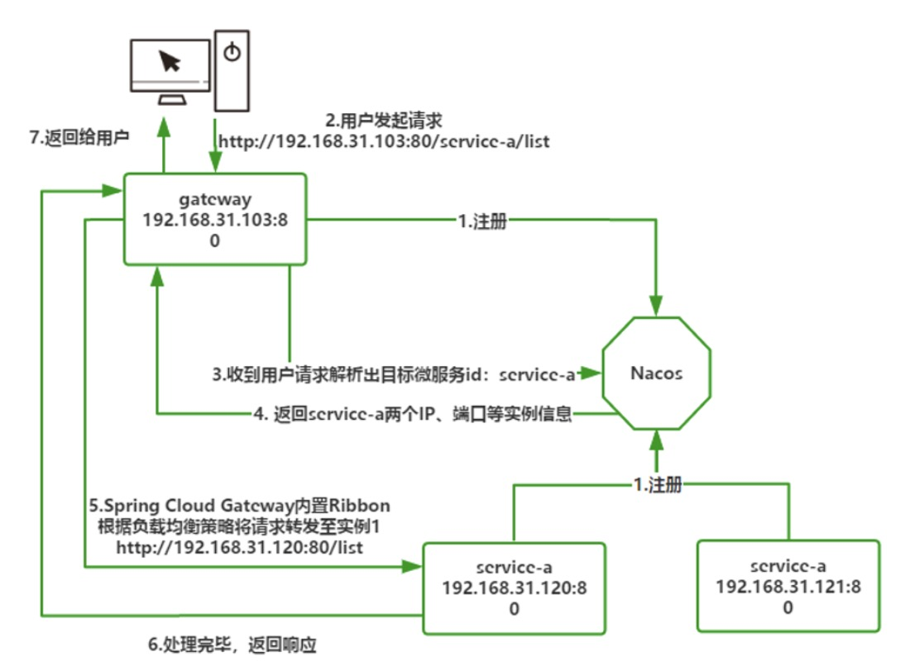
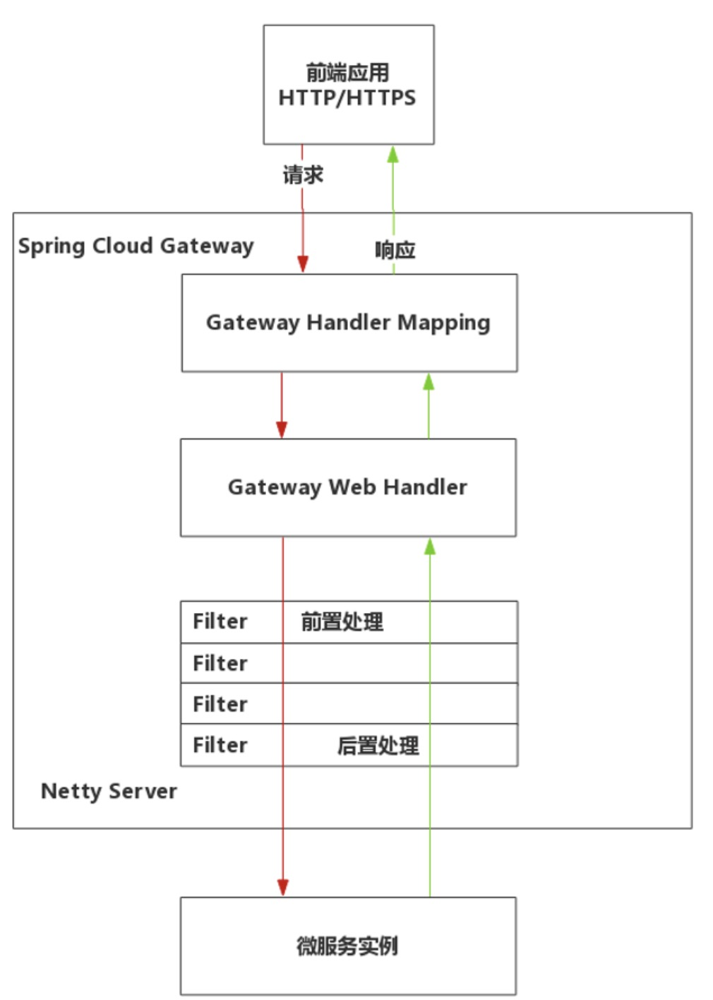

### 如何通过部署 Spring Cloud Gateway 实现 API 路由功能来屏蔽后端细节呢？
> 第一步，利用 Spring Initializr 向导创建 Gateway 工程，确保 pom.xml 引入以下依赖：
```text
<!-- Nacos客户端 -->
<dependency>
    <groupId>com.alibaba.cloud</groupId>
    <artifactId>spring-cloud-starter-alibaba-nacos-discovery</artifactId>
</dependency>
<!-- Spring Cloud Gateway Starter -->
<dependency>
    <groupId>org.springframework.cloud</groupId>
    <artifactId>spring-cloud-starter-gateway</artifactId>
</dependency>
<!-- 对外提供Gateway应用监控指标 -->
<dependency>
    <groupId>org.springframework.boot</groupId>
    <artifactId>spring-boot-starter-actuator</artifactId>
</dependency>
```

> 第二步，在 application.yml 增加如下配置:
```yaml
spring:
  application:
    name: gateway #配置微服务id
  cloud:
    nacos:
      discovery:
        server-addr: 192.168.0.170:8848 #nacos通信地址
        username: nacos
        password: nacos
    gateway: #让gateway通过nacos实现自动路由转发
      discovery:
        locator:
          enabled: true #locator.enabled是自动根据URL规则实现路由转发
server:
  port: 80 #服务端口号
management: 
  endpoints:
    web:
      exposure:
        include: '*' #对外暴露actuator所有监控指标，便于监控系统收集跟踪
```

在上面的配置中最重要的一句是：
> spring.cloud.gateway.discovery.locator.enabled=true

这是一个自动项，允许 Gateway 自动实现后端微服务路由转发， Gateway 工程启动后，在浏览器地址栏按下面格式访问后端服务：
> http://网关IP:端口/微服务id/URI

#### Spring Cloud Gateway执行流程

```text
1、Gateway、service-a 这些都是微服务实例，在启动时向 Nacos 注册登记；

2、用户端向 Gateway 发起请求，请求地址http://192.168.31.103:80/service-a/list；

3、Gateway 网关实例收到请求，解析其中第二部分 service-a，即微服务 Id，第三部分 URI 为“/list”。之后向 Nacos 查询 service-a 可用实例列表；

4、Nacos 返回 120 与 121 两个可用微服务实例信息；

5、Spring Cloud Gateway 内置 Ribbon，根据默认轮询策略将请求转发至 120 实例，转发的完整 URL 将附加用户的 URI，即http://192.168.31.120:80/list；

6、120 实例处理后返回 JSON 响应数据给 Gateway；

7、Gateway 返回给用户端，完成一次完整的请求路由转发过程。
```

### 谓词（Predicate）与过滤器（Filter）
Gateway 网关三个关键名词：路由（Route）、谓词（Predicate）、过滤器（Filter）。

路由（Route）是指一个完整的网关地址映射与处理过程。一个完整的路由包含两部分配置：谓词（Predicate）与过滤器（Filter）。前端应用发来的请求要被转发到哪个微服务上，是由谓词决定的；而转发过程中请求、响应数据被网关如何加工处理是由过滤器决定的。

#### 谓词（Predicate）
将 Gateway 工程的 application.yml 文件修改为下面的设置：
```yaml
spring:
 application:
  name: gateway
 cloud:
  nacos:
   discovery:
    server-addr: 192.168.31.10:8848
    username: nacos
    password: nacos
  gateway:
   discovery:
    locator:
     enabled: false #不再需要Gateway路由转发
   routes: #路由规则配置
    #第一个路由配置，service-a路由规则
    - id: service_a_route #路由唯一标识
     #lb开头代表基于gateway的负载均衡策略选择实例
     uri: lb://service-a
     #谓词配置
     predicates:
      #Path路径谓词，代表用户端URI如果以/a开头便会转发到service-a实例
      - Path=/a/**
      #After生效时间谓词，2020年10月15日后该路由才能在网关对外暴露
      - After=2020-10-05T00:00:00.000+08:00[Asia/Shanghai]
     #谓词配置
     filters:
      #忽略掉第一层前缀进行转发
     - StripPrefix=1
      #为响应头附加X-Response=Blue
     - AddResponseHeader=X-Response,Blue
    #第二个路由配置，service-b路由规则
    - id: service_b_route
     uri: lb://service-b
     predicates:
      - Path=/b/**
     filters:
      - StripPrefix=1
server:
 port: 80
management:
 endpoints:
  web:
   exposure:
    include: '*'
```
在 2020 年 10 月 15 日后，当用户端发来/a/...开头的请求时，Spring Cloud Gateway 会自动获取 service-a 可用实例，默认采用轮询方式将URI附加至实例地址后，形成新地址，service-a处理后 Gateway 网关自动在响应头附加 X-Response=Blue。至于第二个 service_b_route，比较简单，只说明当用户访问/b开头 URL 时，转发到 service-b 可用实例。

完整的路由配置格式固定如下：
```yaml
spring:
  gateway:
   discovery:
    locator:
     enabled: false #不再需要Gateway路由转发
   routes:
    - id: xxx #路由规则id
     uri: lb://微服务id #路由转发至哪个微服务
     predicates:
     # 具体的谓词
     filters:
     # 具体的过滤器
```
其中 predicates 是重点，说明路由生效条件，在这里我将常见的谓词使用形式列出来。

After 代表在指定时点后路由规则生效:
```
predicates:
   - After=2020-10-04T00:00:00.000+08:00
```

Before 代表在指定时点前路由规则生效:
```
predicates:
   - Before=2020-01-20T17:42:47.789-07:00[America/Denver]
```

Path 代表 URI 符合映射规则时生效:
```
predicates:
   - Path=/b/**
```

Header 代表包含指定请求头时生效:
```
predicates:
   - Header=X-Request-Id, \d+
```
如果请求具有名为 X-Request-Id 的 Header，其值与\d+正则表达式匹配（具有一个或多个数字的值），则该路由匹配。

Method 代表要求 HTTP 方法符合规定时生效:
```
predicates:
   - Method=GET
```

谓词是 Gateway 网关中最灵活的部分，刚才列举的是最常用的谓词。对这部分感兴趣可以翻阅[spring-cloud-gateway](https://docs.spring.io/spring-cloud-gateway/docs/current/reference/html/#gateway-request-predicates-factories) 进行学习。

#### 过滤器（Filter）
过滤器（Filter）可以对请求或响应的数据进行额外处理，这里列出三个最常用的内置过滤器进行说明。

AddRequestParameter 是对所有匹配的请求添加一个查询参数:
```
filters:
- AddRequestParameter=foo,bar #在请求参数中追加foo=bar
```

AddResponseHeader 会对所有匹配的请求，在返回结果给客户端之前，在 Header 中添加响应的数据:
```
#在Response中添加Header头，key=X-Response-Foo，Value=Bar。
filters:
- AddResponseHeader=X-Response,Blue
```

Retry 为重试过滤器，当后端服务不可用时，网关会根据配置参数来发起重试请求:
```
filters:
#涉及过滤器参数时，采用name-args的完整写法
- name: Retry #name是内置的过滤器名
  args: #参数部分使用args说明
    retries: 3
    status: 503
```
以上片段含义为，当后端服务返回 503 状态码的响应后，Retry 过滤器会重新发起请求，最多重试 3 次。

以上是三种最常用的内置过滤器的使用案例，因为 Spring Cloud 内置过滤器将近 30 个，这里可以查询[官方资料](https://docs.spring.io/spring-cloud-gateway/docs/2.2.6.RELEASE/reference/html/#gatewayfilter-factories) 。

### Gateway 的执行原理与自定义过滤器

#### Spring Cloud Gateway 的执行原理
下图是 Spring Cloud Gateway 的执行流程:


按执行顺序可以拆解以下几步：
```text
1、Spring Cloud Gateway 启动时基于 Netty Server 监听指定的端口（该端口可以通过 server.port 属性自定义）。当前端应用发送一个请求到网关时，进入 Gateway Handler Mapping 处理过程，网关会根据当前 Gateway 所配置的谓词（Predicate）来决定是由哪个微服务进行处理。

2、确定微服务后，请求向后进入 Gateway Web Handler 处理过程，该过程中 Gateway 根据过滤器（Filters）配置，将请求按前后顺序依次交给 Filter 过滤链进行前置（Pre）处理，前置处理通常是对请求进行前置检查，例如：判断是否包含某个指定请求头、检查请求的 IP 来源是否合法、请求包含的参数是否正确等。

3、当过滤链前置（Pre）处理完毕后，请求会被 Gateway 转发到真正的微服务实例进行处理，微服务处理后会返回响应数据，这些响应数据会按原路径返回被 Gateway 配置的过滤链进行后置处理（Post），后置处理通常是对响应进行额外处理，例如：将处理过程写入日志、为响应附加额外的响应头或者流量监控等。
```
可以看到，在整个处理过程中谓词（Predicate）与过滤器（Filter）起到了重要作用，谓词决定了路径的匹配规则，让 Gateway 确定应用哪个微服务，而 Filter 则是对请求或响应作出实质的前置、后置处理。

在项目中功能场景多种多样，像日常的用户身份鉴权、日志记录、黑白名单、反爬虫等基础功能都可以通过自定义 Filter 为 Gateway 进行功能扩展，下面通过“计时过滤器”为例，讲解如何为 Gateway 绑定自定义全局过滤器。

#### 自定义全局过滤器
在 Spring Cloud Gateway 中，自定义过滤器分为两种，全局过滤器与局部过滤器。两者唯一的区别是：全局过滤器默认应用在所有路由（Route）上，而局部过滤器可以为指定的路由绑定。下面通过“计时过滤器”这个案例讲解全局过滤器的配置。所谓计时过滤器是指任何从网关访问的请求，都要在日志中记录下从请求进入到响应退出的执行时间，通过这个时间运维人员便可以收集并分析哪些功能进行了慢处理，以此为依据进行进一步优化。下面是计时过滤器的代码，通过注释进行了说明。
```java
import org.slf4j.Logger;
import org.slf4j.LoggerFactory;
import org.springframework.cloud.gateway.filter.GatewayFilterChain;
import org.springframework.cloud.gateway.filter.GlobalFilter;
import org.springframework.core.Ordered;
import org.springframework.stereotype.Component;
import org.springframework.web.server.ServerWebExchange;
import reactor.core.publisher.Mono;
@Component //自动实例化并被Spring IOC容器管理
//全局过滤器必须实现两个接口：GlobalFilter、Ordered
//GlobalFilter是全局过滤器接口，实现类要实现filter()方法进行功能扩展
//Ordered接口用于排序，通过实现getOrder()方法返回整数代表执行当前过滤器的前后顺序
public class ElapsedFilter implements GlobalFilter, Ordered {
  //基于slf4j.Logger实现日志输出
  private static final Logger logger = LoggerFactory.getLogger(ElapsedFilter.class);
  //起始时间属性名
  private static final String ELAPSED_TIME_BEGIN = "elapsedTimeBegin";
  /**
  * 实现filter()方法记录处理时间
  * @param exchange 用于获取与当前请求、响应相关的数据，以及设置过滤器间传递的上下文数据
  * @param chain Gateway过滤器链对象
  * @return Mono对应一个异步任务，因为Gateway是基于Netty Server异步处理的,Mono对就代表异步处理完毕的情况。
  */
  @Override
  public Mono<Void> filter(ServerWebExchange exchange, GatewayFilterChain chain) {
    //Pre前置处理部分
    //在请求到达时，往ServerWebExchange上下文环境中放入了一个属性elapsedTimeBegin，保存请求执行前的时间戳
    exchange.getAttributes().put(ELAPSED_TIME_BEGIN, System.currentTimeMillis());

    //chain.filter(exchange).then()对应Post后置处理部分
    //当响应产生后，记录结束与elapsedTimeBegin起始时间比对，获取RESTful API的实际执行时间
    return chain.filter(exchange).then(
        Mono.fromRunnable(() -> { //当前过滤器得到响应时，计算并打印时间
          Long startTime = exchange.getAttribute(ELAPSED_TIME_BEGIN);
          if (startTime != null) {
            logger.info(exchange.getRequest().getRemoteAddress() //远程访问的用户地址
                + " | " + exchange.getRequest().getPath() //Gateway URI
                + " | cost " + (System.currentTimeMillis() - startTime) + "ms"); //处理时间
          }
        })
    );
  }
  //设置为最高优先级，最先执行ElapsedFilter过滤器
  //return Ordered.LOWEST_PRECEDENCE; 代表设置为最低优先级
  @Override
  public int getOrder() {
    return Ordered.HIGHEST_PRECEDENCE;
  }
}
```

运行后通过 Gateway 访问任意微服务便会输出日志：
> 2021-01-10 12:36:01.765 INFO 14052 --- [ctor-http-nio-4] org.fufeng.gateway.filter.ElapsedFilter : /0:0:0:0:0:0:0:1:57873 | /test-service/test | cost 821ms

日志包含四部分：
```text
日志的基础信息包括时间、日志级别、线程、产生的类与方法等。

/0:0:0:0:0:0:0:1:57873 代表访问者的远程 IP 端口等信息。

/test-service/test 是通过 Gateway 访问的完整 URI，第一部分是服务名，第二部分是 RESTful 接口。

cost 821ms 是具体的执行时间。
```
以上就是全局过滤器的开发方法，至于局部过滤器的配置方法与全局过滤器极为相似，[官方文档](https://docs.spring.io/spring-cloud-gateway/docs/current/reference/html/) 。

