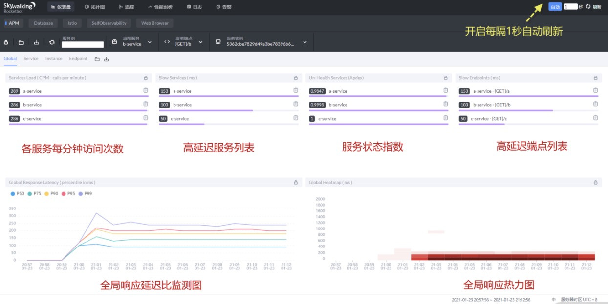

### 应用性能监控

#### SkyWalking 实施链路追踪
> APM 与 SkyWalking

> 部署 SkyWalking 服务端与 Java Agent

> 介绍 SkyWalking 常用视图

#### APM 与 SkyWalking
这些年随着微服务体系的不断完善，链路追踪已经不是什么新兴的概念与技术，很多厂商也提供了自己的链路追踪产品，例如 Spring Cloud Slueth、Zipkin、阿里鹰眼、大众点评 Cat、SkyWalking 等。但这些产品都有一个共同的名字：APM（Application Performance Management），即应用性能管理系统。顾名思义这些产品的根本目的就是对应用程序单点性能与整个分布式应用进行监控，记录每一个环节程序执行状况，通过图表与报表的形式让运维人员随时掌握系统的运行状况，其中在这些著名的产品中我非常推荐各位掌握 SkyWalking 这款 APM 产品，理由很简单，它在简单易用的前提下实现了比 Zipkin 功能更强大的链路追踪、同时拥有更加友好、更详细的监控项，并能自动生成可视化图表。相比 Sleuth+Zipkin 这种不同厂商间混搭组合，SkyWalking 更符合国内软件业的“一站式解决方案”的设计理念。

SkyWalking 是中国人吴晟（华为）开源的应用性能管理系统（APM）工具，使用Java语言开发，后来吴晟将其贡献给 Apache，在 Apache 的背书下 SkyWalking 发展迅速，现在已属于 Apache 旗下顶级开源项目，它的[官网](http://skywalking.apache.org/?fileGuid=xxQTRXtVcqtHK6j8) 。

SkyWalking 提供了分布式追踪、服务网格遥测分析、度量聚合和可视化一体化解决方案。目前在 GitHub 上 SkyWaking 拥有 15.9K Star，最新版本为：8.3.0。

在易用性和使用体验上，SkyWalking 明显好于 Zipkin，功能更丰富的同时也更符合国人习惯，但因为迭代速度较快，社区文档相对陈旧，这也导致很多技术问题需要程序员自己研究解决，因此在解决问题方面需要更多的时间。

#### 部署 SkyWalking 服务端与 Java Agent

##### 部署 SkyWalking 服务端
SkyWalking 同样采用客户端与服务端架构模式，SkyWalking 服务端用于接收来自 Java Agent 客户端发来的链路跟踪与指标数据，汇总统计后由 SkyWalking UI 负责展现。SkyWalking 服务端同时支持 gRPC 与 HTTP 两种上报方式。其中 gRPC 默认监听服务器 11800 端口，HTTP 默认监听 12800 端口，而 SKyWalking UI 应用则默认监听 8080 端口，这三个端口在生产环境下要在防火墙做放行配置。在存储层面，SkyWalking 底层支持 ElasticSearch 、MySQL、H2等多种数据源，官方优先推荐使用 ElasticSearch，如果此时你不会 ElasticSearch 也没关系，按文中步骤操作也能完成部署。


###### 首先部署 SkyWalking 服务端。
ElasticSearch 简称 ES，是业内最著名的全文检索引擎，常用于构建站内搜索引擎，SkyWalking 官方推荐使用 ES 作为数据存储组件。这里直接访问 [ES 官网](https://www.elastic.co/cn/downloads/elasticsearch?fileGuid=xxQTRXtVcqtHK6j8) 下载页。

下载对应平台的 ES 服务器程序。

下载后会得到 elasticsearch-7.10.2-windows-x86_64.zip 文件，解压缩后无须任何修改直接运行 bin/elasticsearch.bat 文件，如果是 Linux 系统则运行 elasticsearch.sh 文件。

默认 ES 监听 9200 与 9300 端口，其中 9200 是 ES 对外提供服务的端口；9300 是 ES 进行集群间通信与数据传输的端口，请确保这两个端口没有被占用。

###### 第二步，下载 SkyWalking。
访问[官网](https://skywalking.apache.org/downloads/)，下载最新版 SkyWalking 8.3.0，注意版本选择 v8.3.0 for ES7。

下载完毕，解压缩文件得到 apache-skywalking-apm-bin-es7 目录。这里有个重要细节，SkyWalking 路径不要包含任何中文、特殊字符甚至是空格，否则启动时会报“找不到模板文件”的异常。

###### 第三步，配置 SkyWalking 数据源。
SKyWalking 收集到的数据要被存储在 ElasticSearch 中，因此需要指定数据源。在 config 目录下找到 application.yml，这是 SkyWalking 的核心配置文件。

在配置文件 103 行附近可以看到 storage 配置片段。
```yaml
storage:
  selector: ${SW_STORAGE:h2}
  elasticsearch: #ES6配置 
    ...
  elasticsearch7: #ES7配置
    nameSpace: ${SW_NAMESPACE:""}
    clusterNodes: ${SW_STORAGE_ES_CLUSTER_NODES:localhost:9200}
    protocol: ${SW_STORAGE_ES_HTTP_PROTOCOL:"http"}
    ...
```
默认 SkyWalking 采用内置 H2 数据库存储监控数据，现在需要改为 elasticsearch7，这样就完成了数据源存储的切换，在启动时 SkyWalking 会自动初始化 ES 的索引。

修改前：
```yaml
selector: ${SW_STORAGE:h2}
```

修改后：
```yaml
selector: ${SW_STORAGE:elasticsearch7}
```
到这里，SkyWalking 数据源配置成功。

###### 第四步，启动 SkyWalking 应用。
在 bin 目录下找到 startup.bat 运行，如果是 Linux 系统运行 startup.sh。

启动后会产生两个 Java 进程：

> Skywalking-Collector 是数据收集服务，默认监听 11800（gRPC）与 12800（HTTP） 端口。

> Skywalking-Webapp 是 SkyWalking UI，用于展示数据，默认监听 8080 端口。

启动成功后，访问http://192.168.31.10:8080/，如果看到 SkyWalking UI 首页，则说明服务端配置成功。

到这里，SkyWalking 服务端启动完毕，下面来说明如何通过 SkyWalking Java Agent 上报链路数据。

###### 安装 SkyWalking Java Agent
SkyWalking 可以在不修改应用源码的前提下，无侵入的实现链路追踪与 JVM 指标监控，它是怎么做到的？这里涉及一个 Java1.5 新增的特性，Java Agent 探针技术，想必对于很多工作多年 Java 工程师来说，Java Agent 也是一个陌生的东西。

Java Agent 探针说白了就是 Java 提供的一种“外挂”技术，允许在应用开发的时候在通过启动时增加 javaagent 参数来外挂一些额外的程序。

Java Agent 并不复杂，其扩展类有这严格的规范，必须创建名为 premain 的方法，该方法将在目标应用 main 方法前执行，下面就是最简单的 Java Agent 扩展类。
```java
public class SimpleAgent {
    public static void premain(String agentArgs, Instrumentation inst) {
        System.out.println("=========开始执行premain============");
    }
}
```
要完成 Java Agent，还需要提供正确的 MANIFEST.MF，以便 JVM 能够选择正确的类。在 META-INF 目录下找到你的 MANIFEST.MF 文件：
```text
Manifest-Version: 1.0
Premain-Class: com.lagou.agent.SimpleAgent
```
之后将这个类打包为 agent.jar，假设原始应用为 oa.jar，在 oa.jar 启动时需要在额外附加 javaagent 参数，如下所示：
```text
java -javaagent:agent.jar -jar oa.jar
```

在应用启动时 Java 控制台会输出如下日志。
```text
=========开始执行 premain============
正在启动 OA 办公自动化系统...
....
```
通过结果你会发现 java agent 在目标应用main执行前先执行了premain，实现了不修改OA源码的前提下增加了新的功能。

SkyWalking 也是利用 Java Agent 的特性，在 premain 中通过字节码增强技术对目标方法进行扩展，当目标方法执行时自动收集链路追踪及监控数据并发往 SkyWalking 服务端。

简单介绍下，用户访问 a 服务的 a 接口，a 服务通过 OpenFeign 远程调用 b 服务的 b 接口，b 服务通过 OpenFeign 调用 c 服务的 c 接口，最后 c 接口通过 JDBC 将业务数据存储到 MySQL 数据库。

演示 SkyWalking Java Agent 的用法，在 skywalking 的 agent 目录下存在 skywalking-agent.jar，这就是 skywalking 提供的 Java Agent 扩展类。

如果是生产环境下在启动应用时附加 javaagent 参数即可。

a 服务启动命令：
> java -javaagent:/apache-skywalking-apm-bin-es7/agent/skywalking-agent.jar -Dskywalking.agent.service_name=a-service -Dskywalking.collector.backend_service=192.168.0.190:11800 -Dskywalking.logging.file_name=a-service-api.log -jar a-service.jar

b 服务启动命令：
> java -javaagent:/apache-skywalking-apm-bin-es7/agent/skywalking-agent.jar -Dskywalking.agent.service_name=b-service -Dskywalking.collector.backend_service=192.168.0.190:11800 -Dskywalking.logging.file_name=b-service-api.log -jar b-service.jar

c 服务启动命令：
> java -javaagent:/apache-skywalking-apm-bin-es7/agent/skywalking-agent.jar -Dskywalking.agent.service_name=c-service -Dskywalking.collector.backend_service=192.168.0.190:11800 -Dskywalking.logging.file_name=c-service-api.log -jar c-service.jar

如果是在 idea 开发环境运行，需要在 VM options 附加 javaagent。
> -javaagent:/apache-skywalking-apm-bin-es7/agent/skywalking-agent.jar -Dskywalking.agent.service_name=c-service -Dskywalking.collector.backend_service=192.168.0.190:11800 -Dskywalking.logging.file_name=c-service-api.log

除了 javaagent 指定具体 agent 文件外，agent 本身也支持一系列配置参数，在刚才的启动时涉及 3 个。
> skywalking.agent.service_name：指定在 SkyWalking 上报数据时的服务名。

> skywalking.collector.backend_service：指定 SkyWalking 服务端的通信IP与端口。

> skywalking.logging.file_name：指定 agent 生成的上报日志文件名，日志文件保存 agent 的 logs 目录中。

##### 介绍 SkyWalking 常用视图
当服务启动后，为了演示需要，利用 PostMan 对 a 接口模拟 10000次 用户访问，看 SkyWalking UI 中产生哪些变化。

此时访问http://192.168.31.10:8080/，打开 SKyWalking UI，默认显示全局的应用性能，具体用途我已在图中标出，其中我认为比较重要的是服务状态指数与高延迟端点列表两项，服务状态指数越接近 1 代表该服务运行状况越好，而高延迟端点列表则将处理延迟高的 API 端点列出，这可能是我们重点排查与优化的对象。


除了全局监控外，SkyWalking 链路追踪的展示也非常友好，点击“拓扑”按钮可以查看访问拓扑图。服务间依赖关系一目了然。

除此之外，链路追踪的展示也非常强大，服务间的 API 调用关系与执行时间、调用状态清晰列出，而且因为 SkyWalking 是方法层面上的扩展，会提供更加详细的方法间的调用过程。

SkyWalking 基于 Java Agent 对数据库的运行指标也进行收集，点击"database"便进入数据库指标监控。

如果你用过 SkyWalking 一定会被它简单的使用方法与强大的功能所折服，在SkyWalking提供了多达几十种不同维度、不同方式的数据展示方案，例如基于服务实例的JVM检测仪表盘就能让我们了解该服务 JVM 的资源分配过程，分析其中潜在的问题。

讲到这，咱们已经完成了 SkyWalking 的安装部署与应用接入，同时也对各种监控图表进行了介绍。因为篇幅有限，只能带着大家对 SkyWalking 进行入门讲解。当然 SKyWalking 也不是全能的，在生产环境下 SkyWalking 还需要额外考虑很多问题，如 SkyWalking 的集群管理、访问权限控制、自监控、风险预警等都要逐步完善，因此很多互联网公司也基于 SkyWalking 做二次开发以满足自身的需求，希望你也能在使用过程中对 SkyWalking 的潜力进行挖掘、了解。


