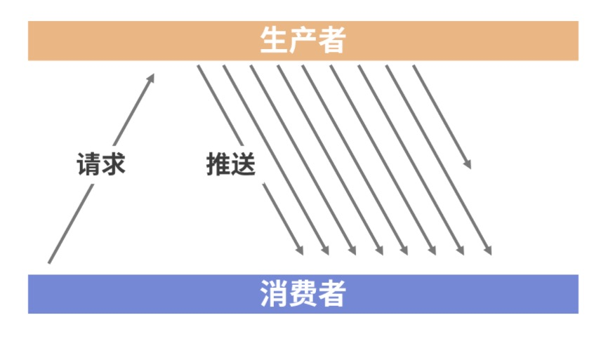
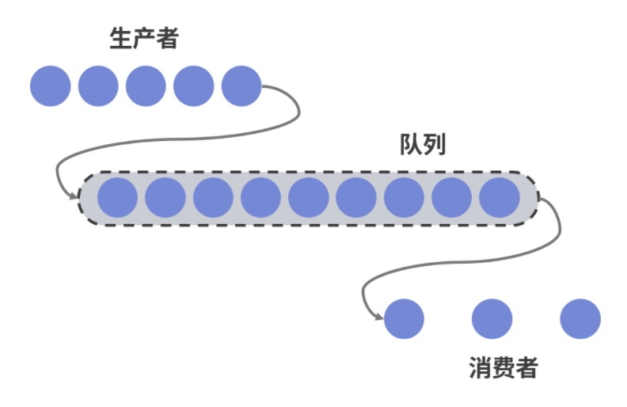
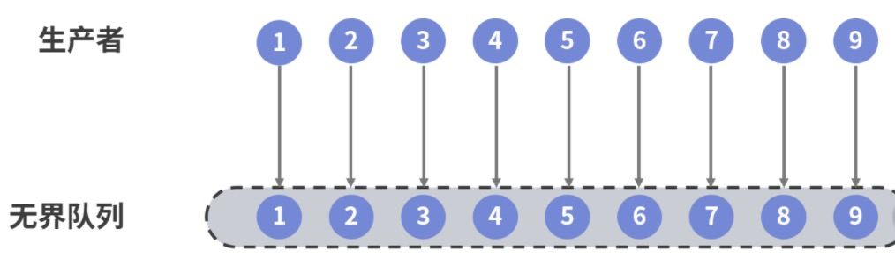
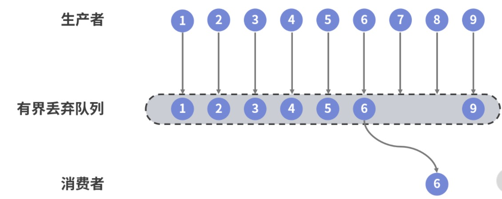
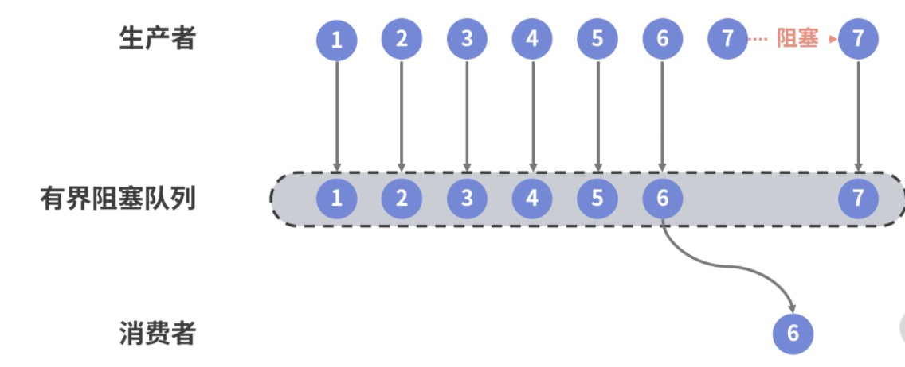

### 流的概念
简单来讲，所谓的流就是由生产者生产并由一个或多个消费者消费的元素序列。这种生产者/消费者模型也可以被称为发布者/订阅者模型。而关于流的介绍，我将从两方面入手，首先明确流的分类，然后再来讨论如何进行流量控制，流量控制是讨论数据流的核心话题。

### 流的处理模型
关于流的处理，存在两种基本的实现机制。一种就是传统开发模式下的“拉”模式，即消费者主动从生产者拉取元素；而另一种就是上一讲中分析的“推”模式，在这种模式下，生产者将元素推送给消费者。相较于“拉”模式，“推”模式下的数据处理的资源利用率更好，下图所示的就是一种典型的推模式处理流程。


上图中，数据流的生产者会持续地生成数据并推送给消费者。这里就引出了流量控制问题，即如果数据的生产者和消费者处理数据的速度是不一致的，我们应该如何确保系统的稳定性呢？

### 流量控制
先来看第一种场景，即生产者生产数据的速率小于消费者的场景。在这种情况下，因为消费者消费数据没有任何压力，也就不需要进行流量的控制。

现实中，更多的是生产者生产数据的速率大于消费者消费数据的场景。这种情况比较复杂，因为消费者可能因为无法处理过多的数据而发生崩溃。针对这种情况的一种常见解决方案是在生产者和消费者之间添加一种类似于消息队列的机制。我们知道队列具有存储并转发的功能，所以可以由它来进行一定的流量控制，效果如下图所示。


现在，问题的关键就转变为如何设计一种合适的队列。通常，可以选择三种不同类型的队列来分别支持不同的功能特性。

#### 无界队列
第一种最容易想到的队列就是无界队列（Unbounded Queue），这种队列原则上拥有无限大小的容量，可以存放所有生产者所生产的消息，如下图所示。


显然，无界队列的优势就是确保了所有消息都能得到消费，但显然会降低系统的回弹性，因为没有一个系统拥有无限的资源。一旦内存等资源被耗尽，系统可能就崩溃了。

#### 有界丢弃队列
与无界队列相对的，更合适的方案是选择一种有界队列。为了避免内存溢出，我们可以使用这样一个队列，一般队列的容量满了，就忽略后续传入的消息，如下图所示。


上图中，可以看出这个有界队列的容量为 6，所以第 7 和第 8 个元素被丢弃了。然后当消费者消费了一部分消息之后，队列出现了新的空闲位置，后续的消息就又被填充到队列中。当然，这里可以设置一些丢弃元素的策略，比方说按照优先级或先进先出等。

有界丢弃队列考虑了资源的限制，比较适合用于允许丢消息的业务场景，但在消息重要性很高的场景显然不可能采取这种队列。

#### 有界阻塞队列
如果需要确保消息不丢失，则需要引入有界阻塞队列。在这种队列中，我们会在队列消息数量达到上限后阻塞生产者，而不是直接丢弃消息，如下图所示。


上图中，队列的容量同样是 6，所以当第 7 个元素到来时，发现队列已经满了，那么生产者就会一直等到队列空间的释放而产生阻塞行为。显然，这种阻塞行为是不可能实现异步操作的，无论从回弹性、弹性还是即时响应性出发，有界阻塞队列都不是理想的解决方案。

#### 背压机制
纯“推”模式下的数据流量会有很多不可控制的因素，并不能直接应用，而是需要在“推”模式和“拉”模式之间考虑一定的平衡性，从而优雅地实现流量控制。这就需要引出响应式系统中非常重要的一个概念——背压机制（Backpressure）。

什么是背压？简单来说就是下游能够向上游反馈流量请求的机制。通过前面的分析，我们知道如果消费者消费数据的速度赶不上生产者生产数据的速度时，它就会持续消耗系统的资源，直到这些资源被消耗殆尽。

这个时候，就需要有一种机制使得消费者可以根据自身当前的处理能力通知生产者来调整生产数据的速度，这种机制就是背压。采用背压机制，消费者会根据自身的处理能力来请求数据，而生产者也会根据消费者的能力来生产数据，从而在两者之间达成一种动态的平衡，确保系统的即时响应性。

### 响应式流规范
针对流量控制的解决方案以及背压机制都包含在响应式流规范中，其中包含了响应式编程的各个核心组件。

#### 响应式流的核心接口
在 Java 的世界中，响应式流规范只定义了四个核心接口，即 Publisher<T>、Subscriber<T>、Subscription 和 Processor<T,R>。

- Publisher<T>

Publisher 代表的就是一种可以生产无限数据的发布者，该接口定义如下所示。
```java
public interface Publisher<T> {
    public void subscribe(Subscriber<? super T> s);
}
```

可以看到，Publisher 根据收到的请求向当前订阅者 Subscriber 发送元素。

- Subscriber <T>

对应的，Subscriber 代表的是一种可以从发布者那里订阅并接收元素的订阅者。Subscriber <T> 接口定义如下所示。
```java
public interface Subscriber<T> {
    public void onSubscribe(Subscription s);
    public void onNext(T t);
    public void onError(Throwable t);
    public void onComplete();
}
```
注意到 Subscriber 接口包含了一组有用的方法，这组方法构成了数据流请求和处理的基本流程。

其中，onSubscribe() 从命名上看就是一个回调方法，当发布者的 subscribe() 方法被调用时就会触发这个回调。而在该方法中有一个参数 Subscription，可以把这个 Subscription 看作是一种用于订阅的上下文对象。Subscription 对象中包含了这次回调中订阅者想要向发布者请求的数据个数。

当订阅关系已经建立，那么发布者就可以调用订阅者的 onNext() 方法向订阅者发送一个数据。这个过程是持续不断的，直到所发送的数据已经达到 Subscription 对象中所请求的数据个数。这时候 onComplete() 方法就会被触发，代表这个数据流已经全部发送结束。而一旦在这个过程中出现了异常，那么就会触发 onError() 方法，我们可以通过这个方法捕获到具体的异常信息进行处理，而数据流也就自动终止了。

- Subscription

Subscription 代表的就是一种订阅上下文对象，它在订阅者和发布者之间进行传输，从而在两者之间形成一种契约关系。Subscription 接口定义如下所示。
```java
public interface Subscription {
    public void request(long n);
    public void cancel();
}
```
这里的 request() 方法用于请求 n 个元素，订阅者可以通过不断调用该方法来向发布者请求数据；而 cancel() 方法显然是用来取消这次订阅。请注意，Subscription 对象是确保生产者和消费者针对数据处理速度达成一种动态平衡的基础，也是流量控制中实现背压机制的关键所在，我们可以通过下图来进一步理解整个数据请求和处理过程。


Publisher、Subscriber 和 Subscription 接口是响应式编程的核心组件，响应式流规范也只包含了这些接口，因此是一个非常抽象且精简的接口规范。结合前面的讨论结果，我们可以明确，响应式流规范实际上提供了一种“推-拉”结合的混合数据流模型。

当然，响应式流规范非常灵活，还可以提供独立的“推”模型和“拉”模型。如果为了实现纯“推”模型，我们可以考虑一次请求足够多的元素；而对于纯“拉”模型，相当于就是在每次调用 Subscriber 的 onNext() 方法时只请求一个新元素。

### 响应式流的技术生态圈
响应式流是一种规范，而该规范的核心价值就在于为业界提供了一种非阻塞式背压的异步流处理标准。各个供应商都可以基于该规范实现自己的响应式开发库，而这些开发库之间则可以做到互相兼容、相互交互。

目前，业界主流响应式开发库包括 RxJava、Akka、Vert.x 以及 Project Reactor。Project Reactor，它是 Spring 5 中所默认集成的响应式开发库。

