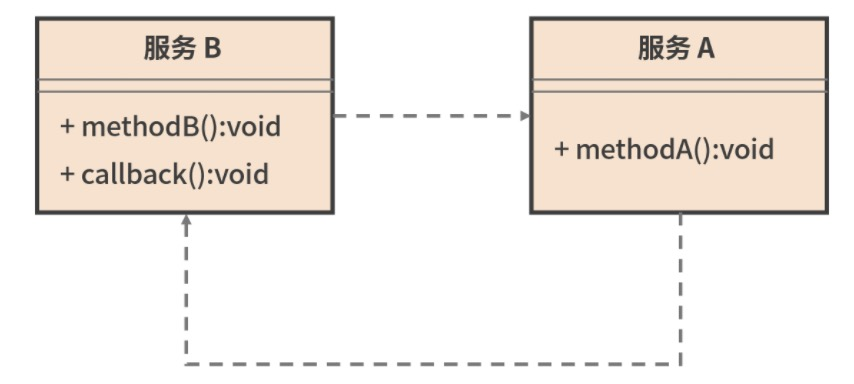
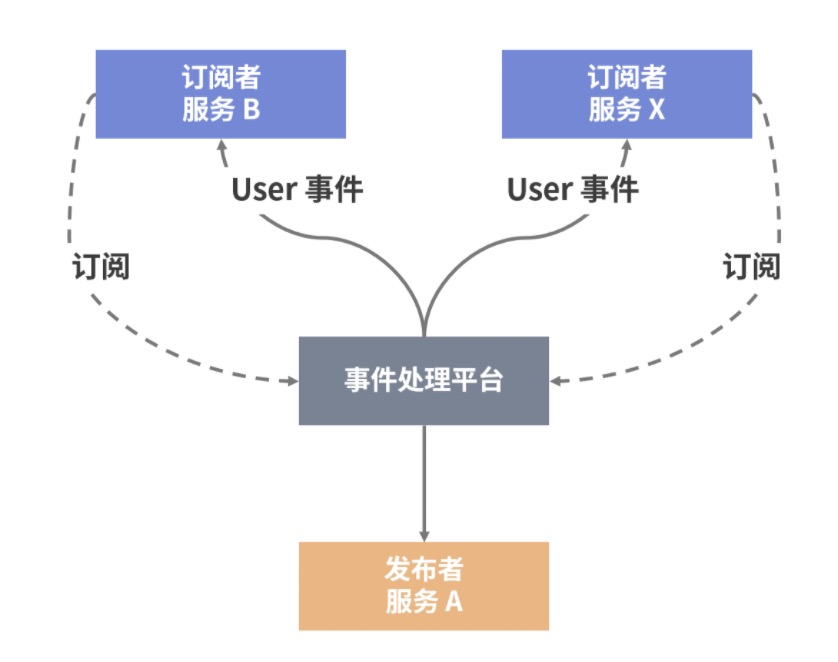
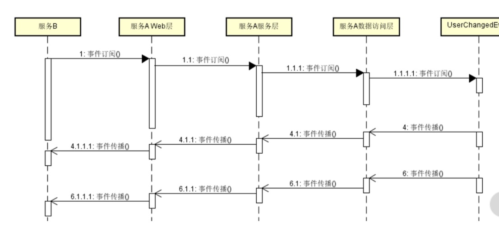
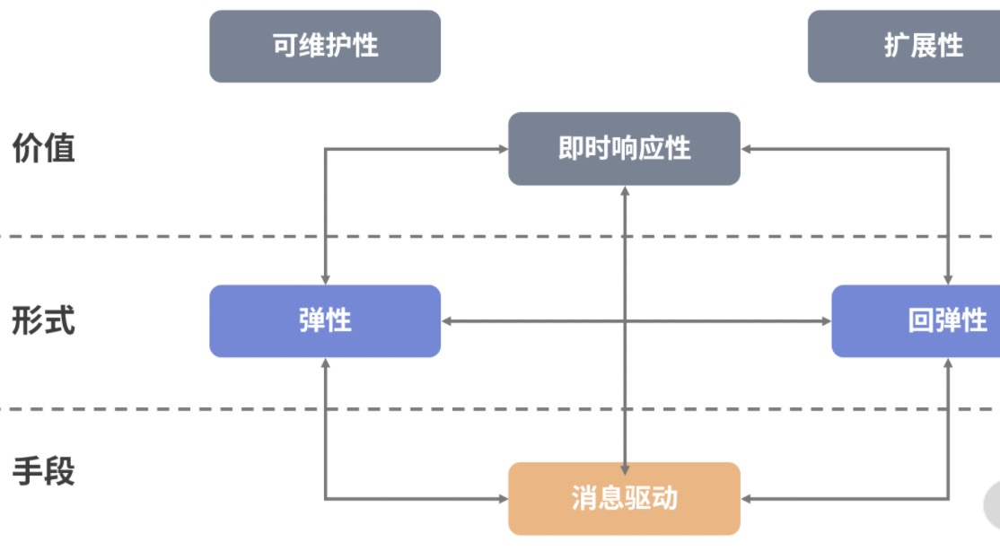

### 从传统开发模式到异步执行技术
现实的开发过程普遍采用的是同步阻塞式的开发模式，以实现业务系统。在这种模式下，开发、调试和维护都很简单。我们先以 Web 系统中最常见的 HTTP 请求为例，来分析其背后的 I/O 模型，从而让你对传统开发模式有进一步的了解。

### Web 请求与 I/O 模型
如果你使用 Spring 框架开发过 Web 应用程序，那么你一定对下面这段代码非常熟悉。
```text
RestTemplate restTemplate = new RestTemplate();
 
ResponseEntity<User> restExchange = restTemplate.exchange(
              "http://localhost:8080/users/{userName}", HttpMethod.GET, null, User.class, userName);
 
User result = restExchange.getBody();
 
process(result);                                              
…
```

这里，我们传入用户名 UserName 调用远程服务获取一个 User 对象，技术上使用了 Spring MVC 中的 RestTemplate 模板工具类，通过该类所提供的 exchange 方法对远程 Web 服务所暴露的 HTTP 端点发起了请求，并对所获取的响应结果进行进一步处理。

这是日常开发过程中非常具有代表性的一种场景，整个过程很熟悉也很自然。

那么，这个实现过程背后有没有一些可以改进的地方呢？为了更好地分析整个调用过程，我们假设服务的提供者为服务 A，而服务的消费者为服务 B，那么这两个服务的交互过程应该是下图所示这样的。


可以看到，当服务 B 向服务 A 发送 HTTP 请求时，线程 B 只有在发起请求和响应结果的一小部分时间内在有效使用 CPU，而更多的时间则只是在阻塞式地等待来自服务 A 中线程的处理结果。显然，整个过程的 CPU 利用效率是很低的，很多时间线程被浪费在了 I/O 阻塞上，无法执行其他的处理过程。

更进一步，我们继续分析服务 A 中的处理过程。如果我们采用典型的 Web 服务分层架构，那么就可以得到如图 2 所示的用户信息查询实现时序图，这是日常开发过程中普遍采用的一种实现方式。

一般我们使用 Web 层所提供的 HTTP 端点作为查询的操作入口，然后该操作入口会进一步调用包含业务逻辑处理的服务层，而服务层再调用数据访问层，数据访问层就会连接到数据库获取数据。数据从数据库中获取之后逐层向上传递，最后返回给服务的调用者。


显然图 2 所展示的整个过程中，每一步的操作过程都存在着前面描述的线程等待问题。也就是说，整个技术栈中的每一个环节都可能是同步阻塞的。

针对同步阻塞问题，在技术上也可以引入一些实现技术来将同步调用转化为异步调用。

### 异步调用的实现技术
在 Java 世界中，为了实现异步非阻塞，一般会采用回调和 Future 这两种机制，但这两种机制都存在一定局限性。

回调的含义如图 3 所示，即服务 B 的 methodB() 方法调用服务 A 的 methodA() 方法，然后服务 A 的 methodA() 方法执行完毕后，再主动调用服务 B 的 callback() 方法。


回调体现的是一种双向的调用方式，实现了服务 A 和服务 B 之间的解耦。在这个 callback 回调方法中，回调的执行是由任务的结果来触发的，所以我们就可以异步来执行某项任务，从而使得调用链路不发生任何的阻塞。

回调的最大问题是复杂性，一旦在执行流程中包含了多层的异步执行和回调，那么就会形成一种嵌套结构，给代码的开发和调试带来很大的挑战。所以回调很难大规模地组合起来使用，因为很快就会导致代码难以理解和维护，从而造成所谓的“回调地狱”问题。

讲完回调，我们来看 Future。可以把 Future 模式简单理解为这样一种场景：我们有一个需要处理的任务，然后把这个任务提交到 Future，Future 就会在一定时间内完成这个任务，而在这段时间内我们可以去做其他事情。作为 Future 模式的实现，Java 中的 Future 接口只包含如下 5 个方法。
```java
public interface Future<V> {
    
    //取消任务的执行
    boolean cancel(boolean mayInterruptIfRunning);
 
    //判断任务是否已经取消
    boolean isCancelled();
 
    //判断任务是否已经完成
    boolean isDone();
 
    //等待任务执行结束并获取结果
    V get() throws InterruptedException, ExecutionException;
 
    //在一定时间内等待任务执行结束并获取结果
    V get(long timeout, TimeUnit unit)
        throws InterruptedException, ExecutionException, TimeoutException;
}
```
从这些基础方法中可以看到，我们可以通过对任务进行灵活的控制和判断，来达到一定的异步执行效果。

但从本质上讲，Future 以及由 Future 所衍生出来的 CompletableFuture 等各种优化方案就是一种多线程技术。多线程假设一些线程可以共享一个 CPU，而 CPU 时间能在多个线程之间共享，这一点就引入了“上下文切换”的概念。

如果想要恢复线程，就需要涉及加载和保存寄存器等一系列计算密集型的操作。因此，大量线程之间的相互协作同样会导致资源利用效率低下。

### 响应式编程实现方法
#### 观察者模式和发布-订阅模式
在引入响应式编程技术之前，我们同样先来回顾一个大家可能都知道的设计模式，即观察者模式。观察者模式拥有一个主题（Subject），其中包含其依赖者列表，这些依赖者被称为观察者（Observer）。主题可以通过一定的机制将任何状态变化通知到观察者。针对前面介绍的用户信息查询操作，我们同样可以应用观察者模式，如下图所示。


如果系统中存在一批类似上图中的用户信息获取场景，针对每个场景都实现一套观察者模式显然是不合适的。更好的方法是使用发布-订阅模式，该模式可以认为是对观察者模式的一种改进。

在这一模式中，发布者和订阅者之间可以没有直接的交互，而是通过发送事件到事件处理平台的方式来完成整合，如下图所示。


由此可见，通过发布-订阅模式，我们可以基于同一套事件发布机制和事件处理平台来应对多种业务场景，不同的场景只需要发送不同的事件即可。

同样，如果我们聚焦于服务 A 的内部，那么从 Web 服务层到数据访问层，再到数据库的整个调用链路，同样可以采用发布-订阅模式进行重构。这时候，我们希望当数据库中的数据一有变化就通知上游组件，而不是上游组件通过主动拉取数据的方式来获取数据。下图展示了这一过程。


显然，现在我们的处理方式发生了本质性的变化。图 6 中，我们没有通过同步执行的方式来获取数据，而是订阅了一个 UserChangedEvent 事件。UserChangedEvent 事件会根据用户信息是否发生变化而进行触发，并在 Web 应用程序的各个层之间进行传播。如果我们在这些层上都对这个事件进行了订阅，那么就可以对其分别进行处理，并最终将处理结果从服务 A 传播到服务 B 中。

#### 数据流与响应式
接下来，我们扩大讨论范围，来想象系统中可能会存在着很多类似 UserChangedEvent 这样的事件。每一种事件会基于用户的操作或者系统自身的行为而被触发，并形成了一个事件的集合。针对事件的集合，我们可以把它们看成是一串串联起来的数据流，而系统的响应能力就体现在对这些数据流的即时响应过程上。

数据流对于技术栈而言是一个全流程的概念。也就是说，无论是从底层数据库，向上到达服务层，最后到 Web 服务层，抑或是在这个流程中所包含的任意中间层组件，整个数据传递链路都应该是采用事件驱动的方式来进行运作的。

这样，我们就可以不采用传统的同步调用方式来处理数据，而是由处于数据库上游的各层组件自动来执行事件。这就是响应式编程的核心特点。

相较传统开发所普遍采用的“拉”模式，在响应式编程下，基于事件的触发和订阅机制，这就形成了一种类似“推”的工作方式。这种工作方式的优势就在于，生成事件和消费事件的过程是异步执行的，所以线程的生命周期都很短，也就意味着资源之间的竞争关系较少，服务器的响应能力也就越高。

### 响应式宣言和响应式系统
讲到这里，在理论和实践的结合下，你应该已经意识到，所谓的“响应式”并不是一件颠覆式的事情，而只是一种新型的编程模式。它不局限于某种开发框架，也并非解决分布式环境下所有问题的银弹，而是随着技术的发展自然而然诞生的一种技术体系。

关于响应式，业界也存在一个著名的响应式宣言，下图就是响应式宣言的官方网站给出的，对于这一宣言的图形化描述。


可以看到，即时响应性（Responsive）、回弹性（Resilient）、弹性（Elastic）以及消息驱动（Message Driven）构成了响应式宣言的主体内容。响应式宣言认为，具备上图中各个特性的系统，就可以称为响应式系统。

而这些特性又可以分为三个层次，其中即时响应性、可维护性（Maintainable）和扩展性（Extensible）体现的是价值，回弹性和弹性是表现形式，而消息驱动则是实现手段。

从设计理念上讲，即时响应性指的就是无论在任何时候，系统都会及时地做出响应，并对那些出现的问题进行快速的检测和处理，这是可用性的基石。

要注意，这里的回弹性和弹性比较容易混用。所谓回弹性指的是系统在出现失败时，依然能够保持即时响应性；而弹性则是指的系统在各种请求压力之下，都能保持即时响应性。

最后的消息驱动指的是响应式系统需要构建异步的消息通信机制。你可以把这里的消息等同于前面提到的事件，通过使用消息通信，可以通过在系统中实现连续的数据流，从而达到对流量进行控制的管理目标。我们知道消息通信是非阻塞的，非阻塞的通信使得只有在有消息到来时才需要资源的投入，而避免了很多同步等待导致的资源浪费。

### 总结
响应式编程的出现有其必然性。另一方面，响应式编程也不是一种完全颠覆式的技术体系，而是在现有的异步调用、观察者模式、发布-订阅模式等的基础上发展起来的一种全新的编程模式，能够给系统带来即时响应性。


